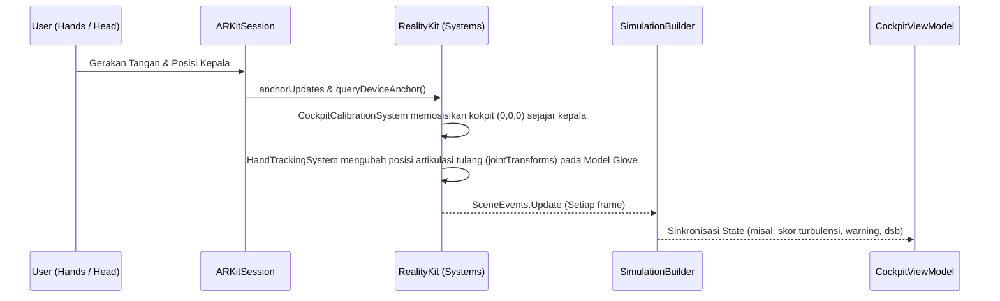

# Severe Weather Evasion (VisionOS)

Proyek ini adalah demonstrasi interaktif untuk Apple Vision Pro, mensimulasikan situasi evakuasi dari zona cuaca ekstrem dengan mengendalikan sebuah *Immersive Cockpit*. Pengguna berinteraksi menggunakan sistem pelacakan tangan spasial (Spatial Hand Tracking) untuk mengendalikan tuas *throttle* dan *sidestick*.

## Arsitektur Utama

Proyek ini dibangun dengan memisahkan _concern_ ke dalam beberapa layer (menggunakan SPM Packages) dan pola desain modern yang diadopsi dari proyek **FlappyVision**:

### 1. MVVM-C (Coordinator Pattern)
- **`AppCoordinator`**: Berfungsi sebagai _single source of truth_ untuk _routing_ aplikasi (misalnya antara layar utama/Intro dan `ImmersiveSpace`).
- **`RootCoordinatorView`**: Sebuah view reaktif yang mengamati perubahan rute dari Coordinator untuk membuka atau menutup `ImmersiveSpace` secara mulus.
- **`IntroView`**: Tampilan awal (2D) dengan efek _glass background_ premium khas visionOS.
*(Catatan: Modul-modul ini dipisah ke dalam package khusus `SevereWeatherUI`)*

### 2. Entity-Component-System (ECS) dengan RealityKit
Arsitektur ECS digunakan untuk menjamin performa tinggi dalam simulasi 3D dan kalkulasi frame-by-frame.
- **Component**: Menyimpan data (contoh: `CockpitComponent`, `HandModelComponent`).
- **System**: Mengandung logika (contoh: `CockpitCalibrationSystem`, `HandTrackingSystem`). Berjalan pada _run-loop_ sinkron setiap frame.
- **Entity**: Objek fisik dalam _scene_ (contoh: `CockpitEntity`, `HandsEntity`).

### 3. Simulation Builder
- **`CockpitSimulationBuilder`**: Bertugas sebagai tempat sentral untuk mendaftarkan semua ECS (Component & System), meload model 3D (`.usdz`) secara asinkron, menambahkan _worldAnchor_, dan menyinkronkan _SceneEvents_ dari ECS kembali ke `CockpitViewModel`.

## Data Flows & Syncing

## Fitur Utama

1. **Auto-Calibration (Posisi Kokpit)**
   Melalui `CockpitCalibrationSystem`, saat Anda pertama kali masuk ke *Immersive Space*, sistem akan membaca `DeviceAnchor` dari *WorldTrackingProvider*. Posisi titik (0,0,0) dari kokpit akan langsung diatur tepat pada posisi kepala Anda, dengan rotasi Y disesuaikan 180° agar kokpit menghadap lurus sesuai pandangan awal Anda, sembari menjaga pitch & roll tetap 0 (rata dengan tanah).

2. **Custom Hand Models**
   Tangan passthrough bawaan VisionOS disembunyikan menggunakan modifier `.upperLimbVisibility(.hidden)`. Sebagai gantinya, aplikasi memuat aset 3D sarung tangan penerbangan (`LeftGlove.usdz` & `RightGlove.usdz`). `HandTrackingSystem` secara otomatis menangkap pergerakan jari (artikulasi `handSkeleton.allJoints`) secara *real-time* dan menerapkannya ke sarung tangan 3D.

## Setup Project
- Konfigurasi Xcode menggunakan `project.yml` (lewat `xcodegen`).
- Seluruh aset RealityKit (`.rkassets` dan `.usda`) disimpan di package `RealityKitContent`.
